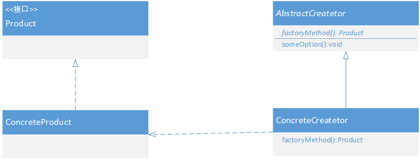

## 目的

定义一个用于创建对象的接口，让接口子类决定具体实例化哪个类。工厂方法使一个类的实例化延迟到工厂子类中。

工厂方法的本质是延迟到子类来选择实现

> 工厂方法模式的主要功能是让父类在不知道具体实现的情况下，完成自身的功能调用；而具体实现延迟到子类来实现。

## UML


- Product：定义实际需要使用的对象的接口
- ConcreteProduct：具体的对象接口实现
- Creator：抽象创建器，定义工厂方法
- ConcreteCreator：具体的创建器，实现工厂方法

## 场景案例

> 实现一个导出数据的框架，让客户端选择导出方式，并执行数据导出。导出的文件格式可以是文本格式，Excel格式，Xml格式等。

## 代码实现

不管用户选择什么导出格式，组后导出的都是一个文件，而系统不知道究竟要导出成文件，因此应该有一个统一的接口约定文件导出的行为。

```java
public interface ExportFile {
    boolean export(String data);
}
```

实现导出文本文件功能
```java
public class ExportTxtFile implements ExportFile {
    public boolean export(String data) {
        // 此处示意，不做真的文件导出实现
        System.out.println("导出数据[" + data + "]到文本文件");
        return true;
    }
}

```

实现导出Excel文件功能
```java
public class ExportExcelFile implements ExportFile {
    public boolean export(String data) {
        // 此处示意，不做真的文件导出实现
        System.out.println("导出数据[" + data + "]到Excel文件");
        return true;
    }
}

```

定义创建器和实现，即实际要使用文件导出功能的对象
```java
public abstract class ExportOperate {
    public boolean export(String data) {
        ExportFile e = factoryMethod();
        return e.export(data);
    }
    
    protected abstract ExportFile factoryMethod();
}

public class ExportTxtOperate extends ExportOperate {
    protected ExportFile factoryMethod() {
        return new ExportTxtFile();
    }
}

public class ExportExcelOperate extends ExportOperate {
   protected ExportFile factoryMethod() {
        return new ExportExcelFile();
   }
}

```

调用演示
```java
public class Application {
    public static void main(String[] args) {
        String data = "测试数据";
        ExportOperate operate = new ExportExcelOperate();
        operate.export(data);

        operate = new ExportTxtOperate();
        operate.export(data);
    }
}
```
## 好处 

- 客户和产品制造逻辑解耦
- 遵循OCP，易于功能扩展；例如需要新增导出word文件格式的功能，现有的代码无需改变，只需扩展导出word文件的实现即可。
- 易于单元测试。工厂方法模式在产品制造过程没有`switch`或`if else`语句。

## 适用场景

以下情况可以考虑使用工厂方法模式

* 如果一个类需要创建某个接口的对象，但又不知道具体的实现时，可以使用工厂方法模式，把创建对象的工作延迟到子类中去实现。
* 一个类希望由其子类指定创建的对象。
