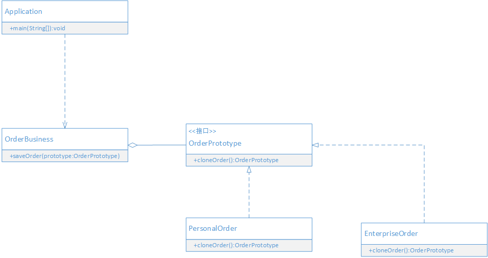

## 目的

用原型实例指定创建对象的类型，并通过拷贝这些原型创建新的对象。

> 原型模式的本质是：克隆生成对象

## 场景案例

> 在订单系统中现有这样的需求：每当订单预定产品数量超过1000的时候，就需要把订单拆分成两份订单来保存，知道每份订单的产品数量不超过1000。
> 根据业务，目前的订单类型分为：个人订单，公司订单。现在要实现一个通用的订单处理系统，不管具体是什么类型的订单，都要能够正常处理。

## UML



- OrderPrototype 订单原型接口，声明一个克隆自身的接口，用来约束想要克隆自己的订单
- PersonalOrder 个人订单类，实现订单原型接口
- EnterpriseOrder 企业订单类，实现订单原型接口
- OrderBusiness: 订单业务处理类，保存订单数据，同时当订单数量超过1000，对订单进行拆分
- Application：相当于客户端，调用订单业务处理类。

## 代码实现

定义订单原型接口，约束具体订单行为

```java

public interface OrderPrototype {
    int getOrderProductNum();
    void setOrderProductNum(int number);
    
    /**
     * 克隆方法
     * @return 原型的实例
     */
    OrderPrototype cloneOrder();
}

```

实现个人订单和企业订单

```java

public class PersonalOrder implements OrderPrototype{
    private String customerName;
    private String productId;
    private int orderProductNum;


    @Override
    public int getOrderProductNum() {
        return orderProductNum;
    }

    @Override
    public void setOrderProductNum(int number) {
        this.orderProductNum = number;
    }

    @Override
    public OrderPrototype cloneOrder() {
        PersonalOrder order = new PersonalOrder();
        order.setCustomerName(customerName);
        order.setProductId(productId);
        order.setOrderProductNum(orderProductNum);
        return order;
    }

    public String getCustomerName() {
        return customerName;
    }

    public void setCustomerName(String customerName) {
        this.customerName = customerName;
    }

    public String getProductId() {
        return productId;
    }

    public void setProductId(String productId) {
        this.productId = productId;
    }

    public String toString() {
        return "订单类型[个人订单], 订购人是[" + customerName + "], 订购产品是[" + productId + "], 订购数量为[" + orderProductNum + "]";
    }
}

public class EnterpriseOrder implements OrderPrototype{
    private String enterpriseName;
    private String productId;
    private int orderProductNum;

    @Override
    public int getOrderProductNum() {
        return orderProductNum;
    }

    @Override
    public void setOrderProductNum(int number) {
        this.orderProductNum = number;
    }

    @Override
    public OrderPrototype cloneOrder() {
        EnterpriseOrder order = new EnterpriseOrder();
        order.setEnterpriseName(enterpriseName);
        order.setOrderProductNum(orderProductNum);
        order.setProductId(productId);
        return order;
    }

    public String getEnterpriseName() {
        return enterpriseName;
    }

    public void setEnterpriseName(String enterpriseName) {
        this.enterpriseName = enterpriseName;
    }

    public String getProductId() {
        return productId;
    }

    public void setProductId(String productId) {
        this.productId = productId;
    }

    public String toString() {
        return "订单类型[企业订], 订购公司是[" + enterpriseName + "], 订购产品是[" + productId + "], 订购数量为[" + orderProductNum + "]";
    }
}

```

实现订单业务处理类

```java

public class OrderBusiness {
    private final static int MAX_NUM = 1000;
    public void saveOrder(OrderPrototype order) {
        List<OrderPrototype> list = new ArrayList<>();
        // 判断当前订单的产品数量是否大于1000
        while (order.getOrderProductNum() > MAX_NUM) {
            // 如果大于1000，就进行拆分
            // 克隆一份订单
            OrderPrototype newOrder = order.cloneOrder();
            // 设置产品数量为1000
            newOrder.setOrderProductNum(MAX_NUM);
            // 原订单的产品数量减去1000
            order.setOrderProductNum(order.getOrderProductNum() - MAX_NUM);
            list.add(newOrder);
        }
        list.add(order);

        System.out.println("订单拆分后，共有" + list.size() + "份订单");
        for(OrderPrototype o : list) {
            System.out.println(o);
        }
    }
}

```

调用演示
```java
public class Application {
    public static void main(String[] args) {
        
        EnterpriseOrder order = new EnterpriseOrder();
        order.setProductId("1548764");
        order.setOrderProductNum(2431);
        order.setEnterpriseName("能力有限公司");

        PersonalOrder o = new PersonalOrder();
        o.setProductId("78451");
        o.setCustomerName("麻花疼");
        o.setOrderProductNum(3124);

        OrderBusiness business = new OrderBusiness();
        business.saveOrder(order);
        business.saveOrder(o);
    }
}
```
## 好处 

- 对客户端隐藏具体实现类型。
- 当创建对象实例非常耗时，通过原型模式创建对象实例比使用`new`来创建对象实例的效率更高。
- 可以在运行时动态改变具体的实现类型。

## 适用场景

以下情况可以考虑使用原型模式

- 如果需要实例化的类是在运行时动态指定时，可以使用原型模式，通过克隆原型来得到需要的实例。
- 如果需要大量创建对象实例，且创建实例的操作非常耗时，可以使用原型模式来提高创建对象的效率。

## 延伸

- [Java中克隆方法以及深克隆和浅克隆](https://github.com/iversonx/design-patterns/tree/master/prototype2)
- [原型管理器](https://github.com/iversonx/design-patterns/tree/master/prototype-manager)